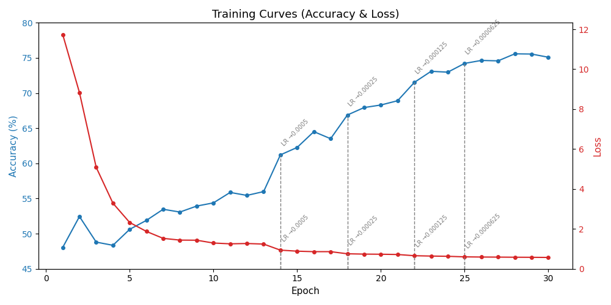
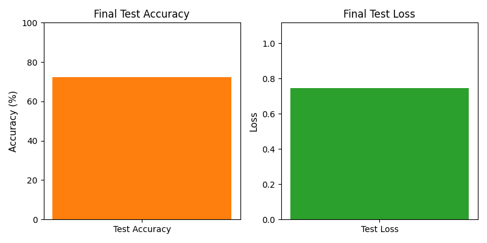

# Skin Lesion Detector

This project uses a Convolutional Neural Network (CNN), built with my custom neural network library, [QuackNet](https://github.com/SirQuackPng/QuackNet), to classify skin lesions based on the HAM10000 dataset. The model focuses on the three largest classes due to significant class imbalance in the dataset.

## Motivation

This project was developed to explore the capabilities of my deep learning library, [QuackNet](https://github.com/SirQuackPng/QuackNet), by applying it to a real-world AI task. Skin lesion classification is a practical example of machine learning being applied to healthcare, allowing me to test QuackNet’s convolutional, pooling, and dense layers.

Rather than focusing solely on high accuracy, the goal was to understand the challenges of training on an imbalanced medical dataset. The model currently achieves moderate performance but provides a strong foundation for future improvements.

## HAM10000 Dataset and Preprocessing

The HAM10000 dataset contains 10,000+ dermatoscopic images across 7 classes:

| Class | Count  |
|-------|--------|
| nv    | 6705   |
| mel   | 1113   |
| bkl   | 1099   |
| bcc   | 514    |
| akiec | 327    |
| vasc  | 142    |
| df    | 115    |

To reduce bias and improve generalisation, only the top 3 classes: nv, mel, and bkl, were used and balanced to contain **1099 images per class**, resulting in **3297 samples**.  

All images were **resized to 64×64** and **normalized**. Simple augmentation (horizontal and vertical flips) was applied to increase the dataset size, resulting in **13,188 training samples**.

## Model Architecture

The CNN was built with 3 convolutional blocks and a FFN:

| Layer Type             | Parameters                                                               |
|------------------------|--------------------------------------------------------------------------|
| Convolutional Layer 1  | kernel size: 3×3, depth: 3, num kernels: 64, stride: 1, padding: none    |
| Activation Layer       | Leaky ReLU                                                               |
| Max Pooling Layer      | grid size: 2×2, stride: 2                                                |
|                        |                                                                          |
| Convolutional Layer 2  | kernel size: 3×3, depth: 64, num kernels: 128, stride: 1, padding: none  |
| Activation Layer       | Leaky ReLU                                                               |
| Max Pooling Layer      | grid size: 2×2, stride: 2                                                |
|                        |                                                                          |
| Convolutional Layer 3  | kernel size: 3×3, depth: 128, num kernels: 256, stride: 1, padding: none |
| Activation Layer       | Leaky ReLU                                                               |
| Max Pooling Layer      | grid size: 2×2, stride: 2                                                |
|                        |                                                                          |
| Global Average Pooling | -                                                                        |  
| Fully Connected Layer  | size: 256                                                                |
| Fully Connected Layer  | size: 3, activation: Softmax                                             |

## Training Details

- **Framework:** QuackNet  
- **Optimiser:** Adam  
- **Learning Rate:** started at 0.001 and decreased to 0.0000625  
- **Loss Function:** Cross-Entropy  
- **Batch Size:** 32  
- **Epochs:** 30  

## Training Curves

  
*Training accuracy and loss curves over 30 epochs. Learning rate reductions are annotated where accuracy plateaued, showing clear jumps in performance after each drop.*

## Test Metrics

  
*Final test accuracy and loss after training on 13,188 samples. Test accuracy (72.38%) and loss (0.74) shows the model generalizes well*

## Results

After training:

- **Training Accuracy:** 75%  
- **Training Loss:** 0.57  
- **Test Accuracy:** 72%  
- **Test Loss:** 0.74  

## Key Observations

- **Learning rate scheduling:** Adjustments were made when training accuracy plateaued, resulting in noticeable jumps:
  - LR reduced from 0.001 to 0.0005 at epoch 14 (accuracy jumped from 55.99% to 61.21%)  
  - LR reduced from 0.0005 to 0.00025 at epoch 18  
  - LR reduced from 0.00025 to 0.000125 at epoch 22  
  - LR reduced from 0.000125 to 0.0000625 at epoch 25 (accuracy jumped from 72.98% to 74.22%)  

- **Accuracy trends:** Accuracy steadily increased after each learning rate reduction, showing that the model continued to learn effectively.  

- **Loss trends:** Training loss decreased smoothly overall, indicating stable convergence despite minor fluctuations.  

- **Test metrics:** Test accuracy (72.38%) and loss (0.74) reflect that the model generalizes reasonably well given the small, balanced dataset.

## Highlights

- Built entirely **without PyTorch or TensorFlow**  
- Uses custom convolutional, pooling, and dense layers via QuackNet  
- Handles class imbalance by dataset reduction  
- Saves and loads weights to disk in **.npz format**  
- Fully **from-scratch CNN implementation**, showcasing learning rate scheduling and custom architecture  